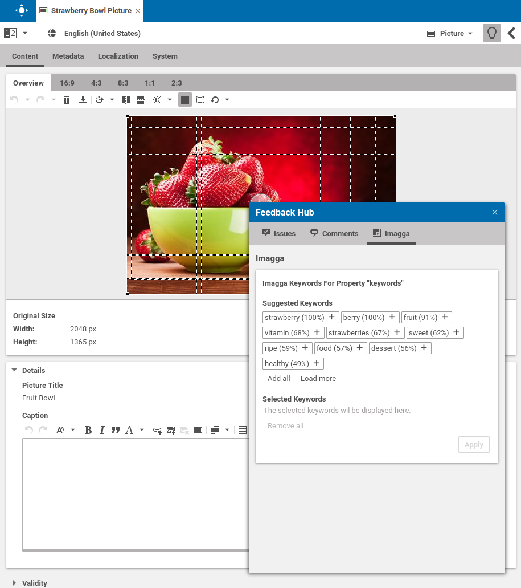
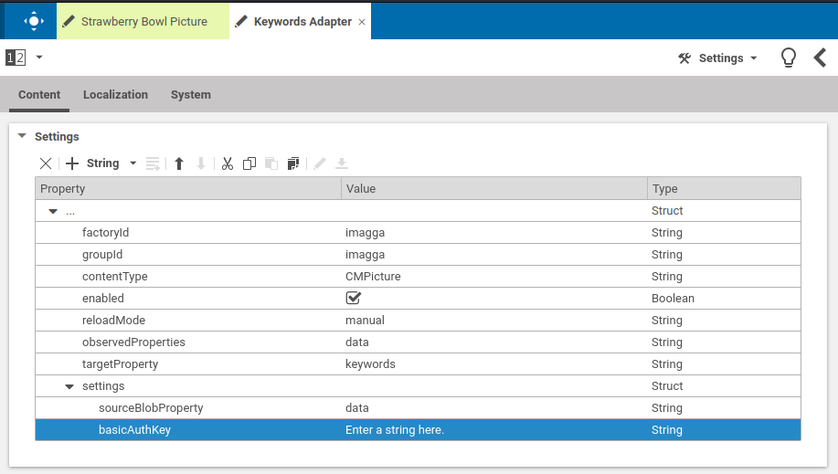
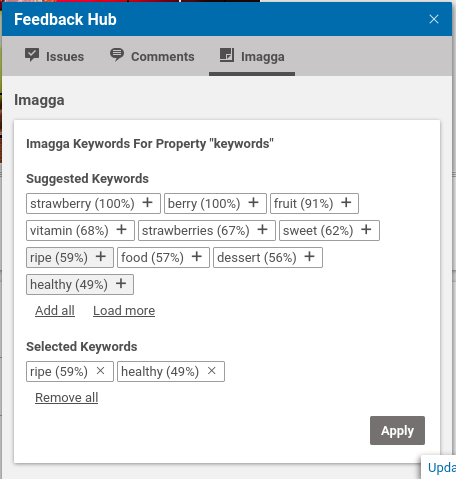
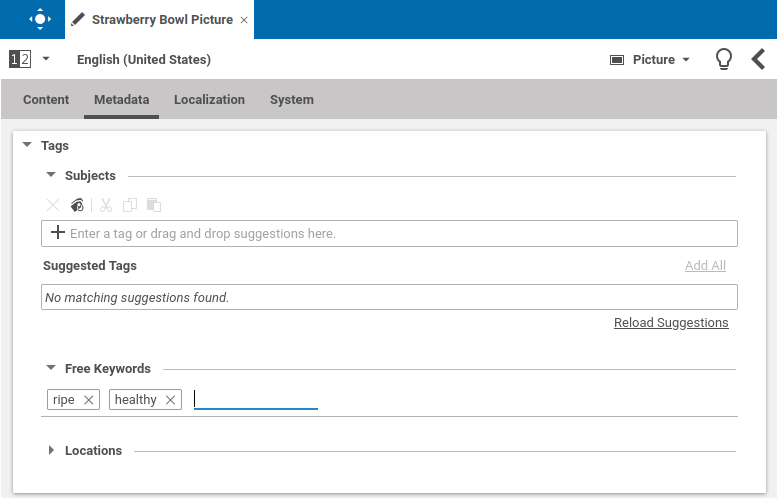

# Editorial Quick Start

--------------------------------------------------------------------------------

\[[Up](README.md)\] \[[Top](#top)\]

--------------------------------------------------------------------------------

## Table of contents

* [Introducing](#introducing)
* [Using the feedback-hub-adapter-imagga](#using-the-feedback-hub-adapter-imagga)
    * [Basic adapter configuration](#basic-adapter-configuration)
        * [Global adapter configuration](#global-adapter-configuration)
        * [Site specific adapter configuration](#site-specific-adapter-configuration)
    * [Detailed adapter configuration](#detailed-adapter-configuration)
        * [Basic structure](#basic-structure)
        * [Required configuration](#required-configuration)
        * [Example](#example)     
* [Usage](#usage)    

## Introducing

As mentioned in the main documentation, the CoreMedia Feedback Hub Imagga plugin
provides access to a configurable path on the server hosting the Studio server. 
All feedback-hub-adapters are visible inside the feedback dialog of a CoreMedia Studio document formular. 
The Studio comes out-of-the-box with the feedback providers "Issues" and "Comments".
The image below shows multiple configured feedback-hub-adapters in Studio.

  
## Using the feedback-hub-adapter-imagga
Depending on the configuration of the adapter, the appearance of the Imagga tab may vary. 
The following sections take care of all configuration **places** and **options**.

### Basic adapter configuration
This section covers the two possibilities to enable the feedback-hub-adapter-imagga integration. 
Please note that those options are valid for all feedback-hub-adapters. 
Before configuring the adapter, please refer to the Studio Developer manual on https://documentation.coremedia.com 
for preliminary steps.

#### Global adapter configuration
To enable the feedback-hub-adapter-imagga for all sites, it is necessary to create a _CMSettings_ document located at:
* _/Settings/Options/Settings/Feedback Hub/_
For convenience reasons, naming proposal of this document is "Keywords Adapter"

#### Site specific adapter configuration
To enable the feedback-hub-adapter-imagga for a single site, it is necessary to create a _CMSettings_ document located at:
* _Options/Settings/Feedback Hub/Connections/_ (relative to the site's root folder)
For convenience reasons, naming proposal of this document is "Keywords Adapter" (or the third party system name)

### Detailed adapter configuration

#### Basic structure

The table below shows the entries which are common for all connectors.

| Key           | Type       | Value                | Required   |
|---------------|------------|------------          |------------|
| factoryId     | String     | <YOUR_FACTORY_ID>    | Yes        |
| groupId       | String     | <SOME_UNIQUE_ID>     | Yes        |
| enabled       | Boolean    | true or false        | Yes        |
| settings      | Struct     |                      | Yes        |
| reloadMode    | String     | auto,manual,none     | No        |
| observedProperties | String  |      | Yes        |
| targetProperty | String  |      | Yes        |
          

#### Required configuration

In section [Basic structure](#basic-structure) and according to the table, the settings struct is currently empty.
The settings struct itself holds specific configuration options for the adapter (common to all adapters).
The table below depicts all potential entries. 

| Key               | Type       | Value                                                    | Required   |
|---------------    |------------|------------                                              |------------|
| sourceBlobProperty | String    | The content property to read the image data from         | Yes        |
| basicAuthKey    | String       | The Imagga API key                                       | Yes        |

#### Example
The image below depicts a full configuration of the feedback-hub-adapter-imagga in global space

## Usage
Once the connector is configured, the "Imagga" named tab appears in the Feedback window, and by clicking on "Imagga"
the image keywords are loaded and shown.

The user can now selected keywords.

  

After applying the keywords, these are added to the "Keyword" property of the _CMPicture_ document.

 
